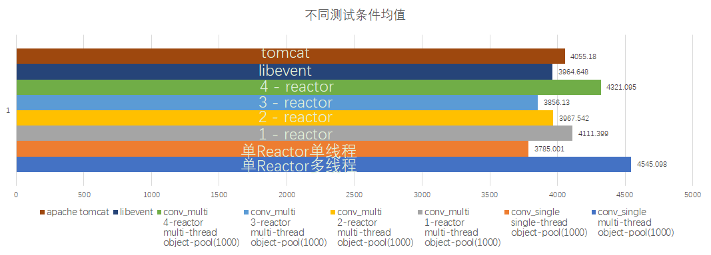

# <font face="Agave Nerd Font">conv_event
### Full name:convenient epoll event

>  Benchmark 
> - conv_event got a high performance in benchmark : )!
  comparator:  libevent && Tomcat
> - webbenchmark:\
> localhost test with 18000 clients test 300s        \
>   conv_event: 1153269 pages/min  6601589 bytes/sec \
>   libevent:   916564  pages/min  5132641 bytes/sec 
> - apache benchmark:\
> 

> 简介: 封装epoll实现单Reactor/主从Reactor模型轻量网络框架 \
> 提供应用层实现案例：\
> conv_event/http 基于conv_event实现的Web服务器  \
> conv_event/detect 基于conv_event+Pytorch+opencv实现的图像识别服务器 \
> 支持:Linux平台 C++11以上标准

> Usage
> 
>[clone]:git clone --recursive https://github.com/OoShawnoO/conv_event.git

- Derived from class hzd::conn
- Methods that must be inherited
    ```c++
    bool process_in(); /* process the EPOLLIN */
    bool process_out(); /* process the EPOLLOUT */
  
  /* template */
  class conn_a : public hzd::conn
  {
  public:
    bool process_in() override
    {
        read(socket_fd,read_buffer,sizeof(read_buffer));
        std::cout << read_buffer<<std::endl;
        return true;
    }
    bool process_out() override
    {
        sprintf(write_buffer,"i am core");
        write(socket_fd, write_buffer,sizeof(write_buffer));
        return true;
    }
  
  };
    ```
- Methods that optional be inherited
    ```c++
    bool process_rdhup(); /* process the EPOLLRDHUP */
    bool process_error(); /* process the EPOLLERR */
    ```

- Multi-reactor model
    ```c++
    /* one reactor for accepting new connect */
    /* multi reactor for distributing event */
    hzd::conv_multi<conn_a> base;
    ```
- Single-reactor model
    ```c++
    /* one reactor for accepting new connect
     * and distributing event */
    hzd::conv_single<conn_a> base;
    ```

- ~~Use multi-thread~~
    ```c++
    hzd::conv_multi<conn_a> base;
    base.multi_thread(); /* 创建线程池 */
    base.wait();
    ```
- Edit conv_event/conf/conf.json to configure project
  ```json
  {
    "ip" : "0.0.0.0",
    "port" : 9999,
    "resource_path" : "resource",
    "multi_thread" : true,
    "thread_count" : 8,
    "max_connect_count" : 200000,
    "max_events_count" : 4096,
    "listen_queue_count" : 2048,
    "object_pool" : true,
    "object_pool_size" : 1024,
    "reactor_count" : 4,
    "one_shot" : true,
    "et" : false,
    "port_reuse" : true,
    "address_reuse" : true
  }
  ```

- Manual register event
    ```c++
    bool process_in/process_out()
   {
        next(EPOLLIN); /* register next event EPOLLIN */
        next(EPOLLOUT); /* register next event EPOLLOUT */
   }
    ```
- Edge Triggered
   ```c++
    /* it works well when you read or write all data form buffer,
     * but when you need read a part of buffer,it will not trigger
     * process_in or process_out until new data coming.*/
    conv.enable_et(); /* enable ET */
    conv.disable_et(); /* disable ET */
   ```
- One shot (Recommended)
   ```c++
    /* pay attention,because of using one_shot need manual register 
     * next event,and using system call epoll_ctl or my next() method.*/
    conv.enable_one_shot();  /* enable one_shot */
    conv.disable_one_shot(); /* disable one_shot */
   ```
- Send && Recv
   ```c++
    /* overload send and recv,you can use my send or recv
     * by this way*/
    send_with_header("message"); /* automatic send sizeof your msg */
    send_with_header(string&); /* send by std::string */
    send(string&,size); /* send char* but need you give size*/
    
    recv_with_header(string&); /* recv string& and type&*/
    recv(string&,size); /* recv such size msg*/
   ```